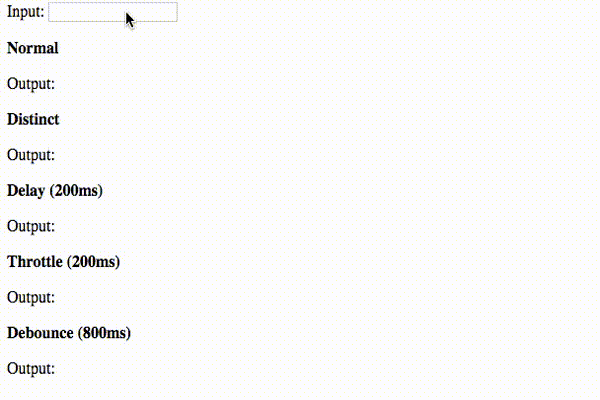

# learning-observable-typescript
A starter project using RxJS Observable in TypeScript containing code samples of a few RxJS operators.



## To run the app
```
git clone https://github.com/joelgeorgev/learning-observable-typescript.git
cd learning-observable-typescript
npm install && npm start
```

## License
MIT